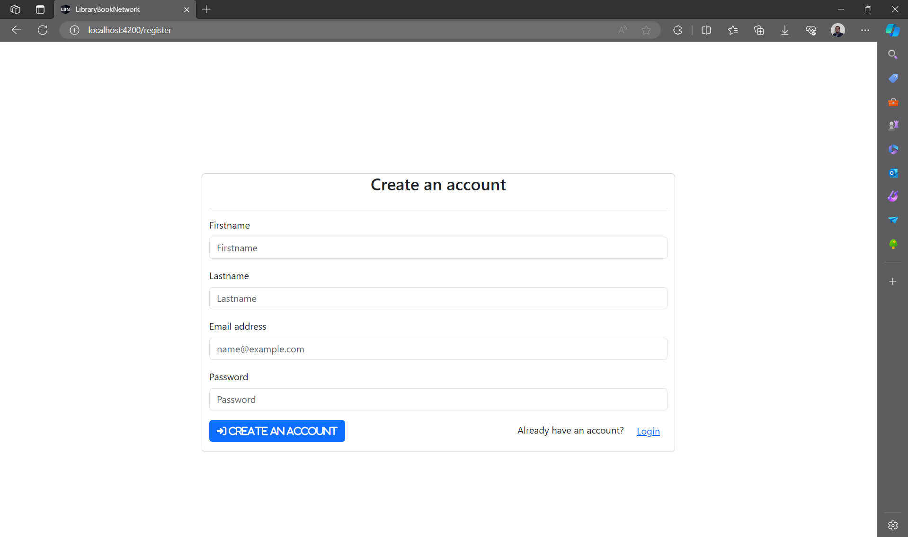
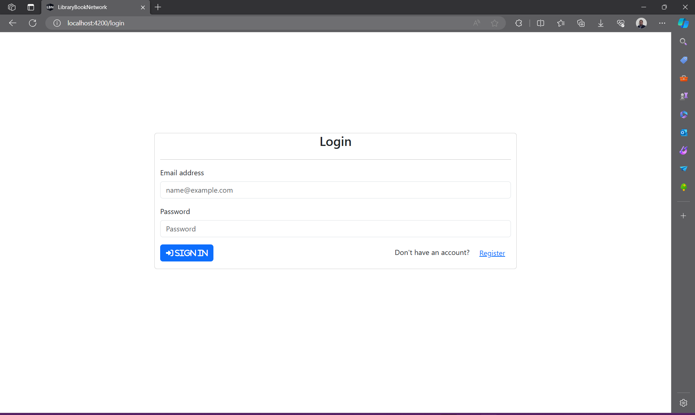
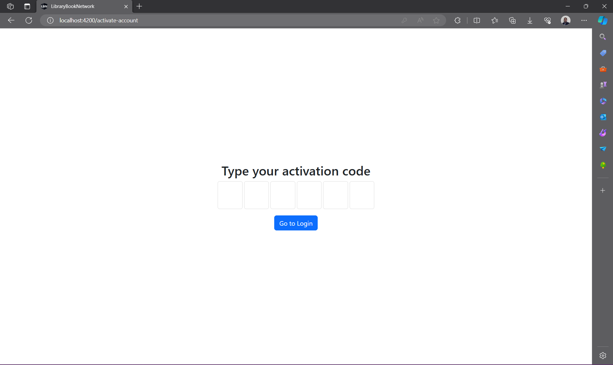
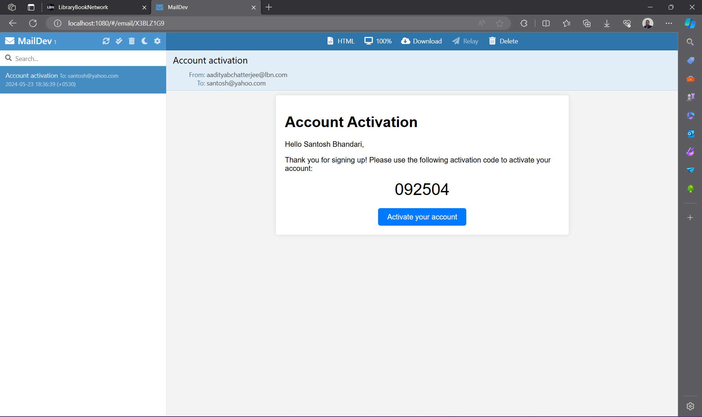
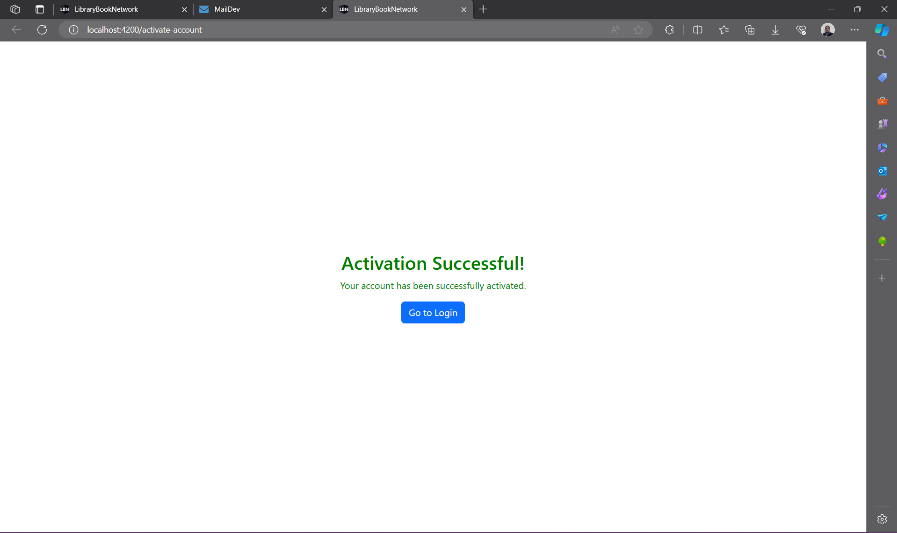
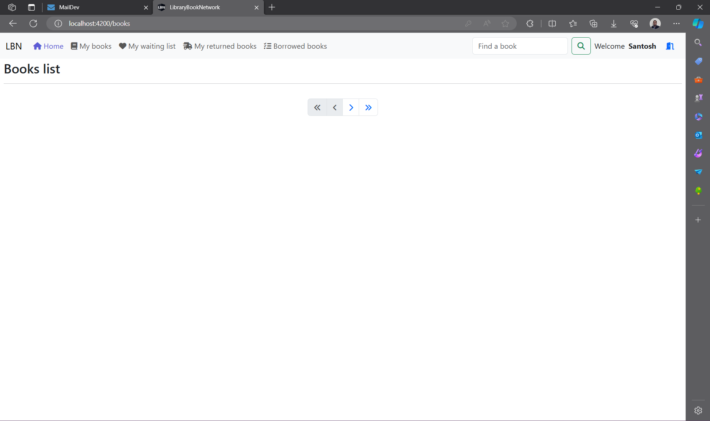
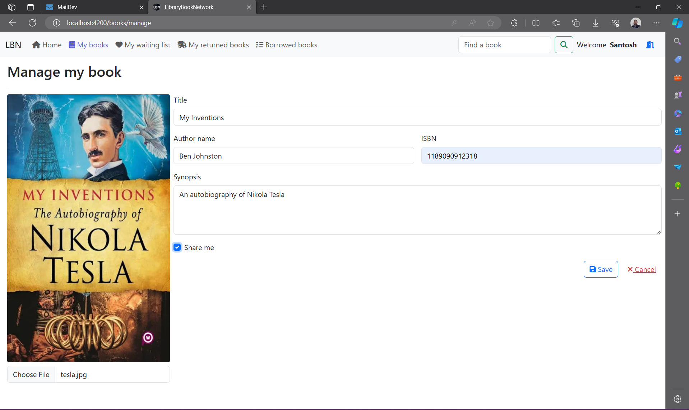
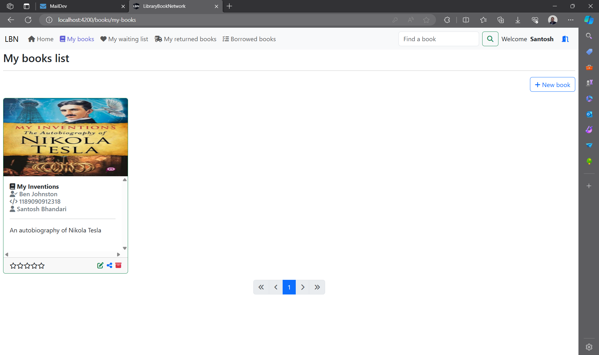

# Library-Book-Network
Kindly go inside to find the "library-book-network-jwt-app" folder to view project.  
Angualr as frontend, Spring boot as backend, PostgreSQL as database.  
Here I've implemented spring security with plain jwt implementation. Will migrate to keycloak in next project.

# Look and feel of the LBN project :

- Register

- Login

- AskForActivation

- Maildev

- Accunt Activated

- Home page

- Adding Book in LBN

- My Book List

