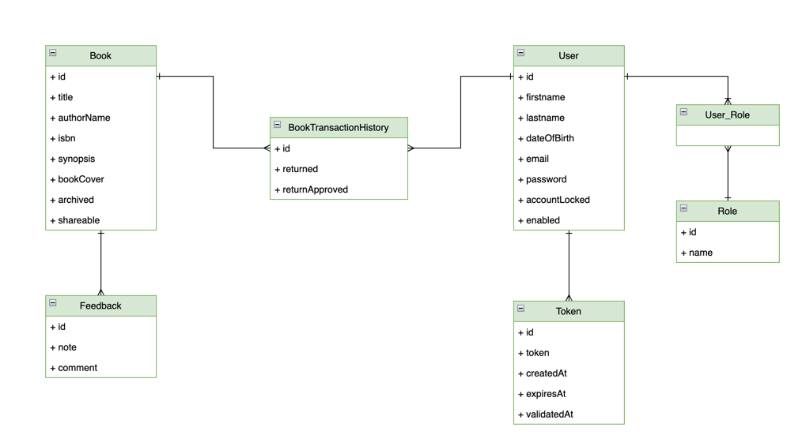
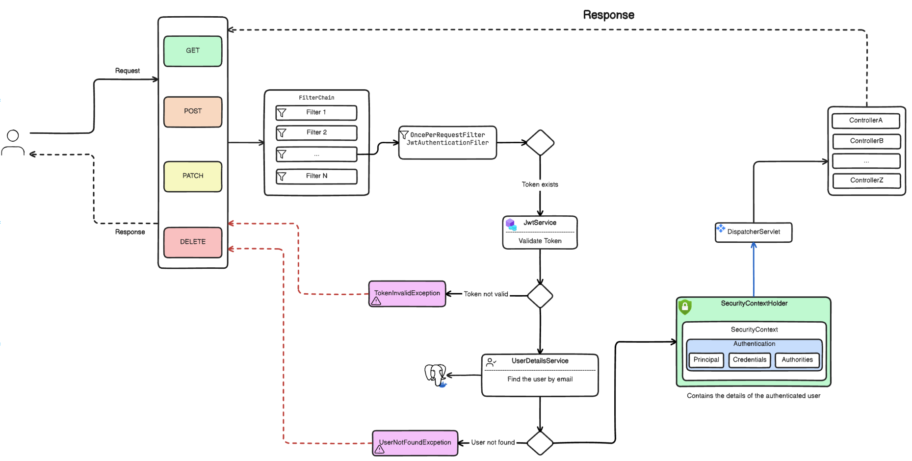
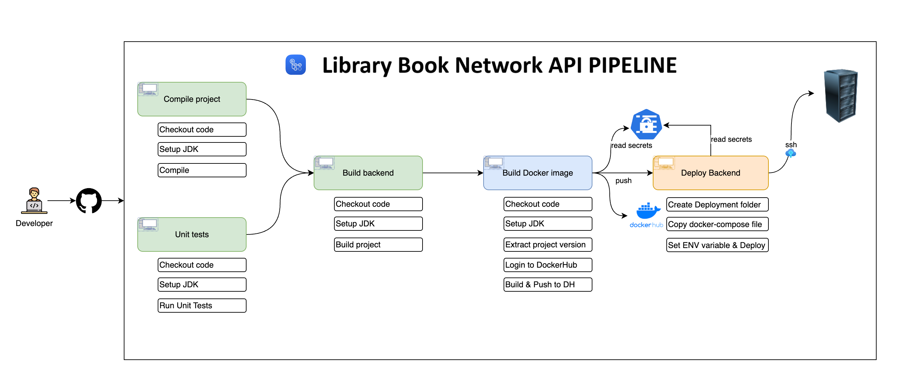
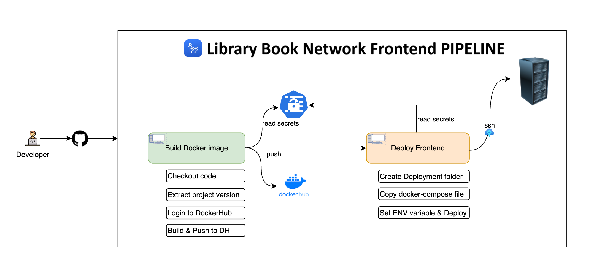

# Library Book Network
A modern library sans physical copy of books but tailored for self-study. It could be a dynamic space filled with motivation,
quiet study areas, collaborative zones, etc. Using this app, one can share their books to fellow library mates, and can also
borrow books from them as well. First book owner has to upload his books details (book- title, cover, Author name, ISBN, synopsis)
in LBN app. App will advertise so and so physical copy of book is with XYZ person and he/she wants to share it.
Any person who is interested to read that book can see that advertise (If he has account in that app) and borrow online first.
Then he will meet that person indiviadually, and grab physical copy of that book with mutual consent of returning date. 
App will take care of facilatating book-sharing, and tracking. When he returns the book, he need to do it online in app too, 
and the owner of the book has to approve that he received the book. Once borrower returns the book and it got approved, 
the same book will be available for re-sharing again. One can also give feedback and rating for book he borrowed and read.

The books with green color border-line means they are sharable. When owner don't want to share his book, he'll archive it. 
Archieve books will have red color border-line and such books are not shown publicly. Only owner can see it.

## How to run this project (Get Started)

To get started with the Library Book Network project, follow the setup instructions in the respective directories:  

- [Backend Setup Instructions](/library-book-network-jwt-app/library-book-network-backend/README.md)
- [Frontend Setup Instructions](/library-book-network-jwt-app/library-book-network-frontend/README.md)
  
OR
  
- First run the docker-desktop, then run the docker-compose file.
- Cross check your postgres db and mail-dev containers. Now run spring boot backend.
- First do `npm install` for downloading dependencies in node_modules to frontend. Now run your frontend using `npm start`.
- Go to browser and hot => http://localhost:4200

## Table of Contents

- [Overview](#overview)
- [Features](#features)
- [Technologies Used](#technologies-used)
    - [Backend (library-book-network-backend)](#library-book-network-backend)
    - [Frontend (library-book-network-frontend)](#library-book-network-frontend)
- [Learning Objectives](#learning-objectives)
- [Getting Started](#getting-started)

## Technical Overview

Library Book Network is a full-stack application that enables users to manage their book collections and engage with a community
of book enthusiasts. It offers features such as user registration, secure email validation, book management (including creation,
updating, sharing, and archiving), book borrowing with checks for availability, book return functionality, and approval of book
returns. The application ensures security using JWT tokens and adheres to best practices in REST API design. The backend is built
with Spring Boot 3 and Spring Security 6, while the frontend is developed using Angular with Bootstrap for styling.

## Features

- User Registration: Users can register for a new account.
- Email Validation: Accounts are activated using secure email validation codes.
- User Authentication: Existing users can log in to their accounts securely.
- Book Management: Users can create, update, share, and archive their books.
- Book Borrowing: Implements necessary checks to determine if a book is borrowable.
- Book Returning: Users can return borrowed books.
- Book Return Approval: Functionality to approve book returns.

#### Class diagram

#### Spring security diagram

#### Backend Pipeline

#### Frontend Pipeline

## Technologies Used

### Backend Technology Used (library-book-network-backend)

- Spring Boot 3
- Spring Security 6
- JWT Token Authentication
- Spring Data JPA
- JSR-303 and Spring Validation
- OpenAPI and Swagger UI Documentation
- Docker

### Frontend (library-book-network-frontend)

- Angular
- Component-Based Architecture
- Lazy Loading
- Authentication Guard
- OpenAPI Generator for Angular
- Bootstrap

## Learning Objectives

By following this project, We can learn:

- Designing a class diagram from business requirements
- Implementing a mono repo approach
- Securing an application using JWT tokens with Spring Security
- Registering users and validating accounts via email
- Utilizing inheritance with Spring Data JPA
- Implementing the service layer and handling application exceptions
- Object validation using JSR-303 and Spring Validation
- Handling custom exceptions
- Implementing pagination and REST API best practices
- Using Spring Profiles for environment-specific configurations
- Documenting APIs using OpenAPI and Swagger UI
- Implementing business requirements and handling business exceptions
- Dockerizing the infrastructure

## Soon, I will migrate this project to keyclaok for liveraging AUTH 2.0 from jwt-based security. Working on it.
